# Bamazon

## Bamazon Customer
The customer will be given the total inventory list with the item id, name, and price shown. The customer will then be prompted on which item id and quantity they want to buy, and they'll be given the total price of their purchase.
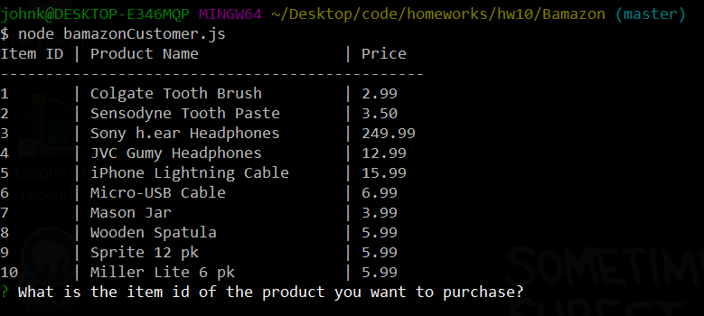
#### Buying items
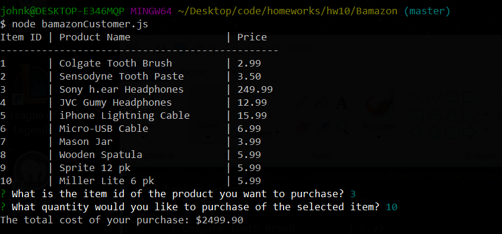

## Bamazon Manager
The Manger will be given four different actions: View products for sale, view low inventory, add to inventory, and add new product. View low inventory will show items with a quantity less than 5.
#### View Products for sale
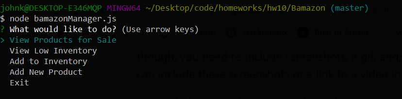
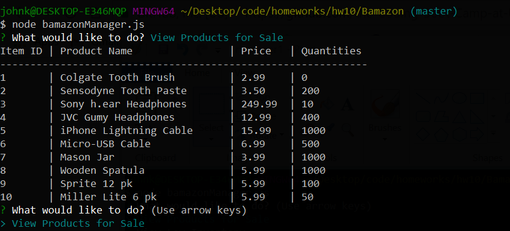
#### View Low Inventory
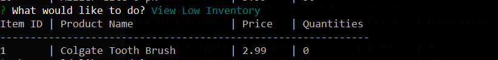
#### Add to Inventory
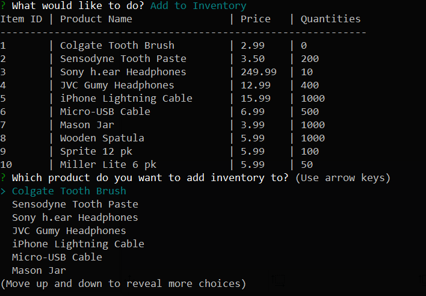

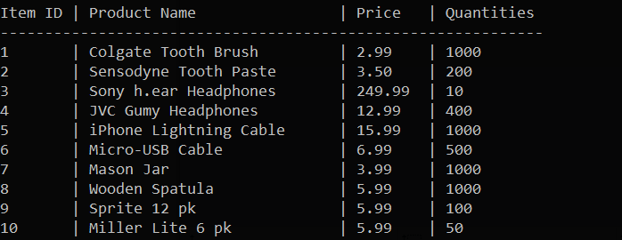
#### Add new Product
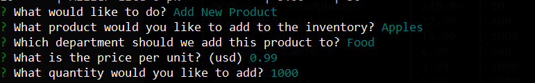
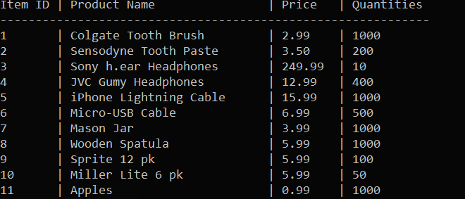

## Bamazon Supervisor
The Supervisor will be given the option to view departments and then to add a new department.
#### View Departments
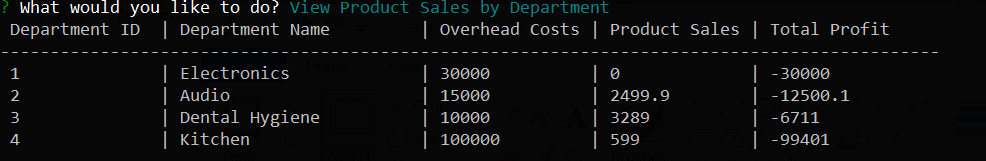
#### Add New Department
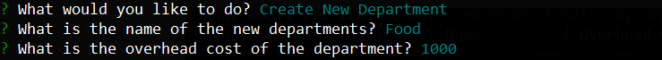
